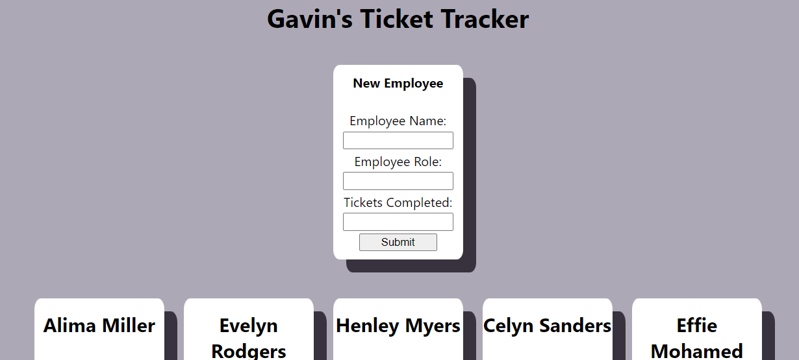

# Ticket Tracker App with React

This is my ticket tracker app which I created with React.

It is hosted on Github Pages here: https://gavinstirling.github.io/ticket-tracker/!

The goal of this project was to demonstrate useState in the react application.

### This is the layout of the ticket tracker app:
(The page is only done in desktop version)

### This is the form to add a new employee to the roster:
